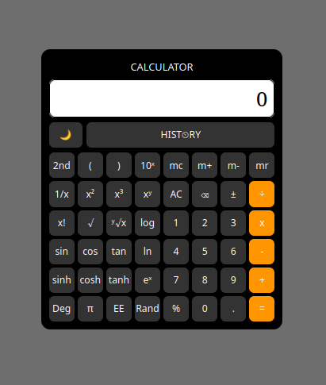
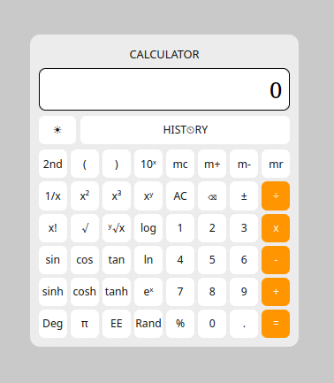

# 🧮 Scientific Calculator

🌐 **Live Demo:** https://gr3atsage.github.io/scientific-calculator/

💻 **Source Code:** https://github.com/GR3ATSAGE/scientific-calculator

A modern scientific calculator built using **HTML**, **CSS**, and **JavaScript**.

## Features

- Scientific functions
- Trigonometric & inverse trigonometric functions
- Hyperbolic functions
- Degree / Radian mode
- Memory operations (MC, MR, M+, M-)
- Calculation history
- Dark & Light themes
- Responsive design
- Keyboard support
- Error handling

## Technologies Used

- HTML5
- CSS3
- JavaScript (Vanilla)

## Screenshots

### Dark Theme



### Light Theme



## Run Locally

Clone the repository

```bash
git clone https://github.com/YOUR_USERNAME/scientific-calculator.git
```

Open

```
index.html
```

in your browser.

## Author

Rocky Das
